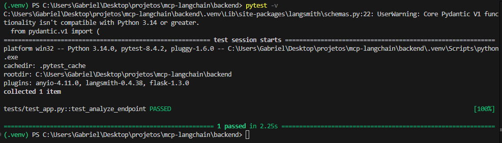

# Multi-Channel Processing App (MCP)

---

## Project Overview

**MCP (Multi-Channel Processing)** is a web application for automated text analysis. Users submit text through a simple interface, and the backend processes it to provide:

1. **Summarization** – concise summaries of the text.  
2. **Sentiment Analysis** – determines sentiment (Positive, Neutral, Negative).  
3. **Keyword Extraction** – identifies key topics from the text.

The backend uses **Flask**, **LangChain**, and **OpenAI GPT-3.5**, while the frontend is built in **React**. Results are stored in **SQLite** for persistence and tracking.

---

## Features

- Intuitive React frontend for text submission and result display.  
- Flask backend with REST API for processing text.  
- Modular LLM pipeline using **LangChain**.  
- Persistent storage in SQLite for messages and analysis results.  
- Automated test suite with **pytest** and mocked LLM calls.  

---

## Tech Stack

- **Frontend:** React (Vite), JavaScript, Axios  
- **Backend:** Flask, SQLAlchemy, Flask-CORS  
- **Database:** SQLite  
- **LLM/AI:** LangChain v0.2+, OpenAI GPT-3.5  
- **Testing:** Pytest, Flask test client, Monkeypatch  

---

## Project Structure

backend/
│ ├─ app.py # Flask backend
│ ├─ chains.py # LLM processing logic
│ ├─ models.py # Database models (optional)
│ ├─ tests/ # Test suite
│ └─ requirements.txt
frontend/
│ ├─ src/
│ │ ├─ App.jsx # Main React app
│ │ └─ components/ # UI components
│ └─ package.json

yaml
Copiar código

---

## How it Works

1. **User Input:** Enter text in the frontend.  
2. **API Call:** Frontend sends a POST request to `/api/analyze`.  
3. **Text Processing:** Backend uses `run_chain` to generate:
   - Summary  
   - Sentiment  
   - Keywords  
4. **Database Storage:** Results saved in SQLite.  
5. **Display Results:** Returned JSON is displayed in the frontend.

---

Structure:
- backend/: Flask API that stores messages and calls LangChain chains
- frontend/: Vite + React frontend consuming the API

Run backend:
- cd backend
- python -m venv .venv
- .venv\Scripts\activate.ps1
- pip install -r requirements.txt
- copy .env.example to .env and set OPENAI_API_KEY
- python app.py

Unit test for backend:
- pytest -v

Obs: What this test does spins up an in-memory SQLite DB (so your real messages.db stays untouched). Mocks the LangChain LLM using monkeypatch to skip API calls and return fake results. Sends a POST request to /api/analyze with test text. Verifies that: Response is valid JSON with summary, sentiment, keywords and a message was inserted in the database.

Run frontend:
- cd frontend
- npm install
- npm run dev

Note: For production, add authentication and move LLM calls to background workers.

Prompts tips:
1. Summarization: ask for word or sentence limits; instruct style (bullet points vs one paragraph).
2. Sentiment: prefer JSON outputs or fixed enumerations (positive/neutral/negative) to ease parsing.
3. Keywords: ask for exactly N keywords, or key phrases; if you want multi-word phrases, instruct the model: “prefer 1–3 word phrases”.
4. Temperature: use low temperature (0 — 0.3) for deterministic outputs.
5. Token limits: for very long texts, chunk before summarizing or use a chain-of-thought summarization pattern (chunk → intermediate summaries → final summary).